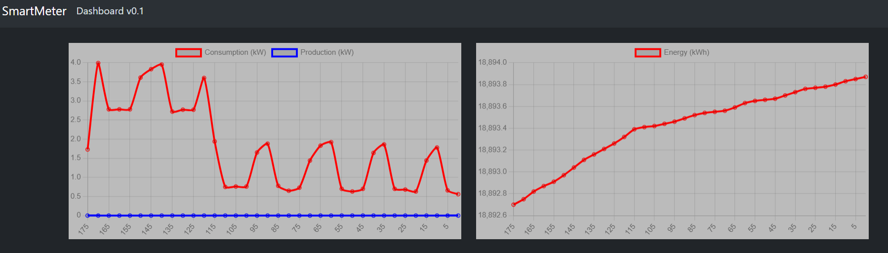

# SmartMeter Software

You can find here the firmware for the SmartMeter project. It uses a Wemos D1 mini lite
(https://www.wemos.cc/en/latest/d1/d1_mini_lite.html). Note that only the last version is
available that is used by the hardware version 2.0 and 2.1.

## ArduinoSketch (ESP8266 and ESP32S2 compatible)

This software is created using the Arduino IDE (https://www.arduino.cc/en/software). After
installing the IDE you need to add the ESP8266 boards. You can find a tutorial here: 
https://siytek.com/wemos-d1-mini-arduino-wifi/. Furthermore, you need to install some 
libraries:
- Install library WiFiManager by tablatronics: https://github.com/tzapu/WiFiManager
- Install library JsonArduino by Banoit Blanchon: https://arduinojson.org/?utm_source=meta&utm_medium=library.properties
- Install library pubsubclient by Nick O'Leary: https://github.com/knolleary/pubsubclient

when you are finished, you can compile and upload the sketch. In the case, you like more functionality
you can create the software yourself. We appreciate contribution by pull requests! You can become
part of the project as well.

This project is actively maintained, see the release for the latest updates

## Functionality and services
The firmware implements the functionality to read the P1 messages from the Smart Meter that is connected and delivers some services to your home network.

### mDNS / Multicast DNS
The DIY Smartmeter serves a mDNS server in order to easily find your DIY Smartmeter that is connected to your local network. It uses multicast IP-addresses to find out the IP-address and the services running by the DIY Smartmeter. To check if it is working, you can easily type in your browser [http://diy_smartmeter.local](http://diy_smartmeter.local). You will see the dashboard that is published by the DIY Smartmeter.

### HTTP Dashboard
The HTTPS dashboard that is pusblished by the DIY Smartmeter, shows your actual energy consumption and production. Note that this webpage can be easily hosted by the DIY Smartmeter, while most of the code is downloaded from the github repo. In order to see this dashboard, you can type in your browser: [http://diy_smartmeter.local](http://diy_smartmeter.local). The image below is on example of the dashboard.



The following endpoints are served by the web server:
- /: The root of the web page that servers the dashboard.
- /data: The data endpoint that serves the energy consumption and production in JSON format.

Note, that memory is limited on the DIY Smartmeter, so not many data history is available in the dashboard. For more information of all your data points, you can check the public research server.

### P1 data server
On port 3141 the DIY Smartmeter is exposing a data server that sends raw P1 messages that are received from your Smartmeter. Note that the clients that can be connected are limited. Default two clients are able to connect. If too many clients are connected you will receive ```DIY Smartmeter P1 - too many clients connected```. So, it will be clear!

When connected you will get first a header message telling that you are connecter with the DIY Smartmeter P1 server. After that you will receive the raw P1 messages when it is received from the Smart Meter that is connected. Below an example with one raw P1 message:
```
DIY Smartmeter P1\n
/Ene5\\T211 ESMR 5.0\r\n\r\n1-3:0.2.8(50)\r\n0-0:1.0.0(250812225130S)\r\n0-0:96.1.1(*****************ID***************)\r\n1-0:1.8.1(012127.922*kWh)\r\n1-0:1.8.2(006766.244*kWh)\r\n1-0:2.8.1(003532.249*kWh)\r\n1-0:2.8.2(009276.445*kWh)\r\n0-0:96.14.0(0001)\r\n1-0:1.7.0(00.610*kW)\r\n1-0:2.7.0(00.000*kW)\r\n0-0:96.7.21(00017)\r\n0-0:96.7.9(00007)\r\n1-0:99.97.0(2)(0-0:96.7.19)(230621102410S)(0000004757*s)(221007100958S)(0000024711*s)\r\n1-0:32.32.0(00002)\r\n1-0:52.32.0(00002)\r\n1-0:72.32.0(00004)\r\n1-0:32.36.0(00000)\r\n1-0:52.36.0(00000)\r\n1-0:72.36.0(00000)\r\n0-0:96.13.0()\r\n1-0:32.7.0(228.0*V)\r\n1-0:52.7.0(230.0*V)\r\n1-0:72.7.0(228.0*V)\r\n1-0:31.7.0(001*A)\r\n1-0:51.7.0(001*A)\r\n1-0:71.7.0(003*A)\r\n1-0:21.7.0(00.226*kW)\r\n1-0:41.7.0(00.127*kW)\r\n1-0:61.7.0(00.255*kW)\r\n1-0:22.7.0(00.000*kW)\r\n1-0:42.7.0(00.000*kW)\r\n1-0:62.7.0(00.000*kW)\r\n!85FE\r\n
```

This service can be used for example:
1. To connect the DIY Smartmeter to your Home Assistant, see for more information the [wiki](https://github.com/AvansETI/SmartMeter_DIY/wiki/7.-Using-Home-Assistant-for-monitoring-the-P1-meter.). 
2. You can use this also for your own software implementation. An Python example is available that connects to the service and prints the P1 messages received: [p1dataclient.py](https://github.com/AvansETI/SmartMeter_DIY/blob/master/Software/p1dataclient.py)
3. You can use the P1 Extender to simulate your Smartmeter at home at a remote place, for example a electric car charger. For more information see [P1-Extender](https://github.com/macsnoeren/P1-Extender).

## MQTT client
MQTT client is used to connect to the research MQTT server and share the Smart Meter P1 data that is received. This data is publically available and used for research and eduacation. 

## Anonimize P1 data
The P1 data contains personal identifiable information, namely the equipment identifiers. These identifiers are used by the energy companies to link the meter to a real person. While this data is not used for research we should remove this information. Therefore the firmware has the possibility to anonimize the P1 data to make all the equipment identifiers zero. This option can be switched off when configuring the device in the first step.
