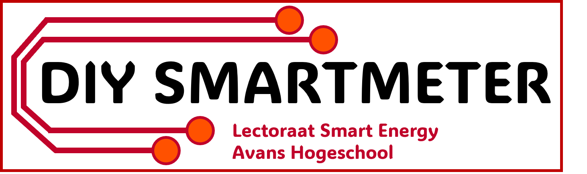

Bij het lectoraat Smart Energy, onderdeel van het Centre of Expertise Materialen en Energietransitie (MNEXT) van Avans Hogeschool te Breda, is een goedkoop en eenvoudig in elkaar te zetten do-it-yourself (DIY) kit(je) ontwikkeld, waarmee de slimme energiemeter thuis kan worden uitgelezen. Het kitje bestaat uit een printplaat, een minicomputer en wat losse elektronicacomponenten. Het in elkaar solderen, configureren en thuis aansluiten op de slimme energiemeter is een eenvoudige klus.

Dit inititief is ontstaan binnen de onderzoekslijn Meten & Weten. Het is belangrijk om meer inzicht te krijgen in het energieverbruik van het eigen huishouden. Door dit kitje kunnen consumenten en bedrijven inzicht krijgen in hun eigen energieverbruik.

Het doel van dit project is informatie te verzamelen van  veel aangesloten slimme meters ter ondersteuning van onderzoek en onderwijs. Alle verzamelde informatie is  moeilijk herleidbaar tot personen en/of locaties. De verzamelde informatie is openbaar om de energietransitie te ondersteunen.

Doe jij ook mee?

## Quick start
Heb je jouw DIY Smartmeter kitje al bemachtigd? Kijk dan op de [wiki](https://github.com/AvansETI/SmartMeter_DIY/wiki). Hier kan je de bouwhandleiding vinden voor het solderen van de printplaat én het uploaden van de firmware. Neem contact op met het lectoraat om in bezit te komen van dit gave kitje. Zie hieronder wat belangrijke links die je kan gebruiken.

* Wiki: [https://github.com/AvansETI/SmartMeter_DIY/wiki](https://github.com/AvansETI/SmartMeter_DIY/wiki)
* Source: [https://github.com/AvansETI/SmartMeter_DIY](https://github.com/AvansETI/SmartMeter_DIY)
* Lectoraat Smart Energy: [https://www.avans.nl/onderzoek/expertisecentra/mnext/lectoraten/smart-energy](https://www.avans.nl/onderzoek/expertisecentra/mnext/lectoraten/smart-energy)

## Meedoen
Niet alleen wij hebben goede ideeën. Jij kan ook meedoen. Heb je een leuk idee dan kan je dat via de issues dat kenbaar maken. Aan zowel de hardware en software kan je werken. Voor meer informatie zie [wiki](https://github.com/AvansETI/SmartMeter_DIY/wiki/8.-Contribute-to-the-software).

## Licentie
Alle documenten, hardware, software en documentatie zijn beschikbaar onder de [MIT-licentie](LICENSE.txt).
